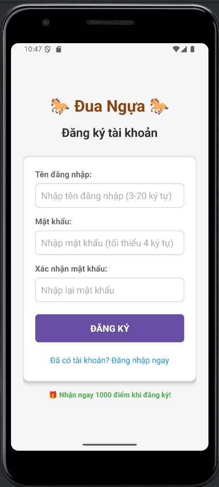
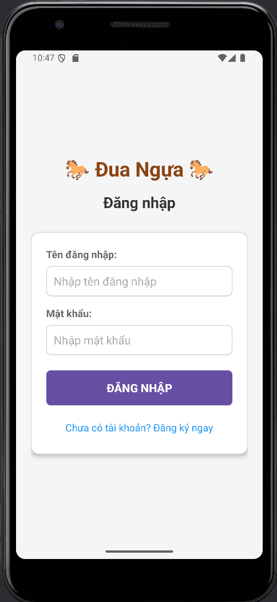
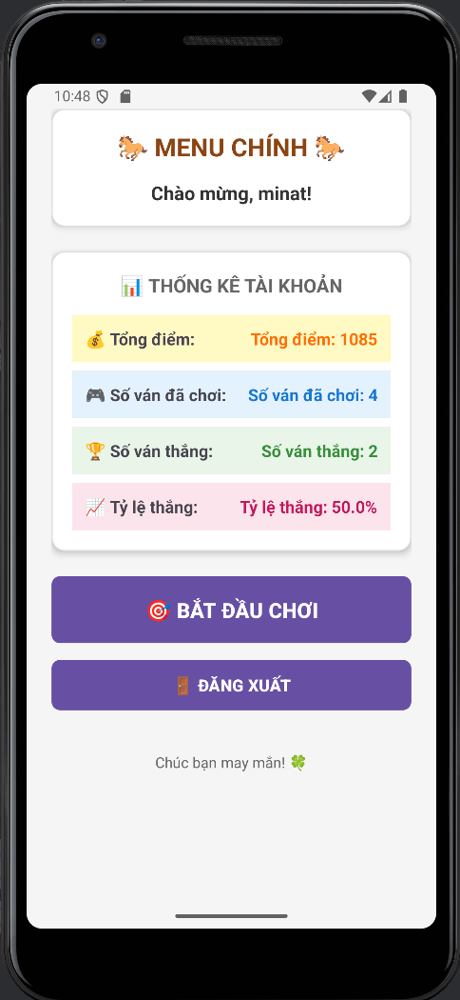
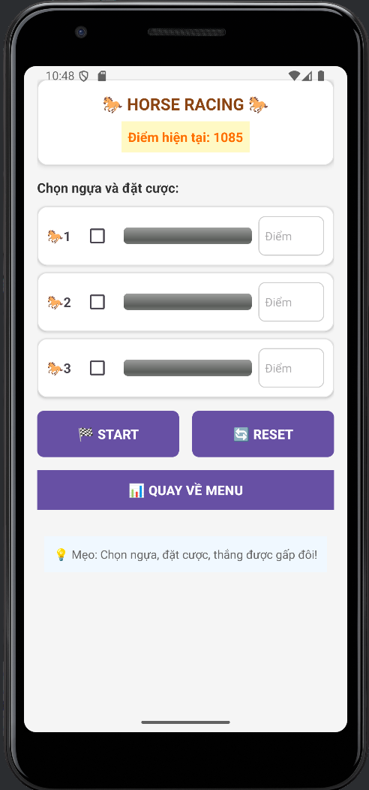

# 🐎 Horse Racing Game - Android Application
[](https://android.com)
[](https://java.com)

> **Ứng dụng game đua ngựa với hệ thống tài khoản và quản lý điểm số cho Android**


## 📖 Mô tả dự án

**Horse Racing Game** là một ứng dụng game đua ngựa được phát triển cho nền tảng Android. Người chơi có thể đăng ký tài khoản, đặt cược vào các con ngựa và theo dõi thống kê game của mình.

### ✨ Tính năng chính

- 🔐 **Hệ thống tài khoản**: Đăng ký, đăng nhập với mật khẩu được mã hóa
- 🎮 **Game đua ngựa**: 3 con ngựa chạy đua với animation thời gian thực
- 💰 **Hệ thống cược**: Đặt cược điểm số với tỷ lệ thắng x2
- 📊 **Thống kê**: Theo dõi số ván chơi, số ván thắng, tỷ lệ thắng
- 💾 **Lưu trữ offline**: Dữ liệu được lưu local với SharedPreferences
- 🎯 **Quản lý điểm**: Hệ thống điểm số persistent qua các phiên

## 📱 Screenshots

*Thêm screenshots vào folder `/screenshots` và link ở đây*

| Register Screen | Login Screen | Menu Screen | Game Screen |
|:---:|:---:|:---:|
|  |  |  |  |

## 🛠️ Công nghệ sử dụng

### **Core Technologies**
- **Language**: Java 11+
- **Platform**: Android (API 21+)
- **IDE**: Android Studio
- **Build System**: Gradle

### **Android Components**
- **Activities**: 5 activities (Splash, Login, Register, Menu, Game)
- **Layouts**: XML layouts với responsive design
- **Storage**: SharedPreferences cho data persistence
- **Threading**: Handler & Runnable cho animation
- **Security**: SHA-256 password hashing

### **UI/UX**
- **Design Pattern**: Material Design guidelines
- **Animations**: Progress bar animations cho horse racing
- **User Experience**: Intuitive navigation flow

### **Architecture**
```
├── Activities (UI Layer)
├── UserManager (Business Logic)
├── SharedPreferences (Data Layer)
└── Resources (Assets & Layouts)
```


## 🚀 Hướng dẫn cài đặt

### **Yêu cầu hệ thống**
- Android Studio 4.0+
- JDK 11+
- Android SDK (API 21+)
- Gradle 7.0+

## 🎯 Hướng dẫn sử dụng

### **1. Đăng ký tài khoản**
- Mở app lần đầu → Màn hình đăng ký
- Nhập username (3-20 ký tự)
- Nhập password (tối thiểu 4 ký tự)
- Nhận 1000 điểm khởi đầu

### **2. Chơi game**
- Chọn ngựa muốn cược (có thể chọn nhiều)
- Nhập số điểm cược
- Bấm START để bắt đầu đua
- Thắng được x2 số điểm đã cược

### **3. Xem thống kê**
- Menu hiển thị tổng điểm
- Số ván đã chơi / thắng
- Tỷ lệ thắng phần trăm

## 💡 Tính năng nổi bật

### **🔒 Bảo mật**
- Password được hash SHA-256
- Validation input
- Session management an toàn

### **📊 Analytics**
- Theo dõi behavior người chơi
- Thống kê chi tiết
- Persistence data

### **🎨 UI/UX**
- Material Design
- Smooth animations
- Intuitive navigation

---

⭐ **Star this repository if you find it helpful!** ⭐
